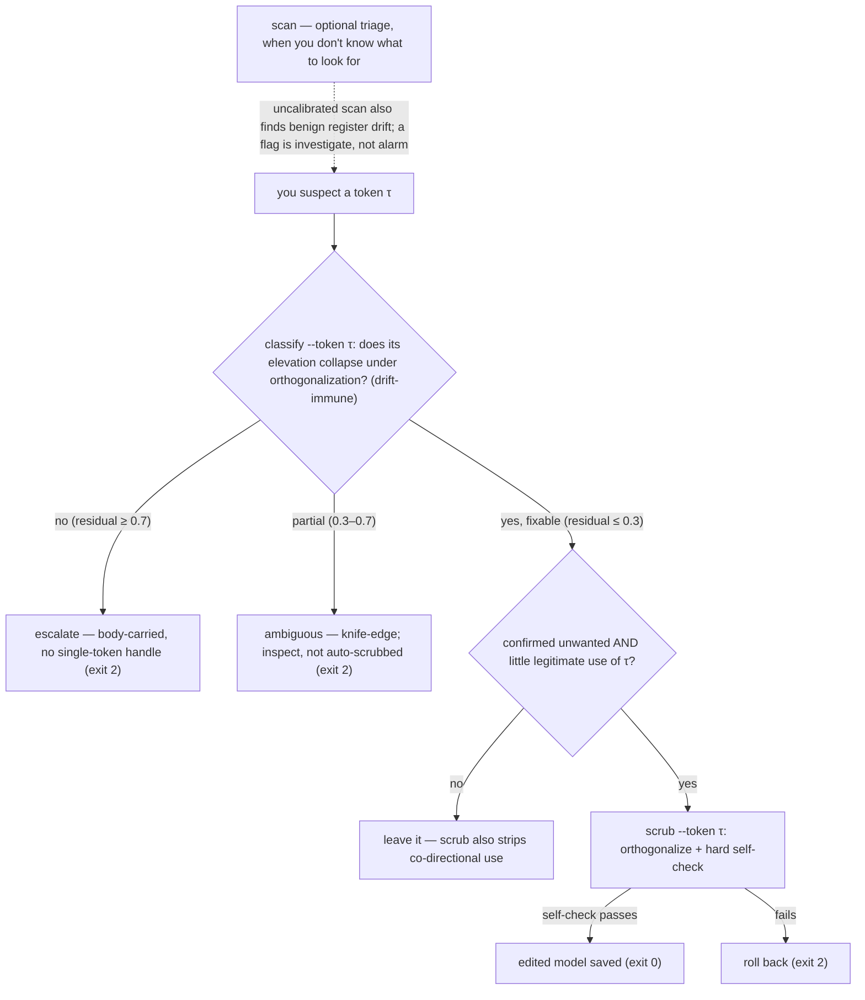
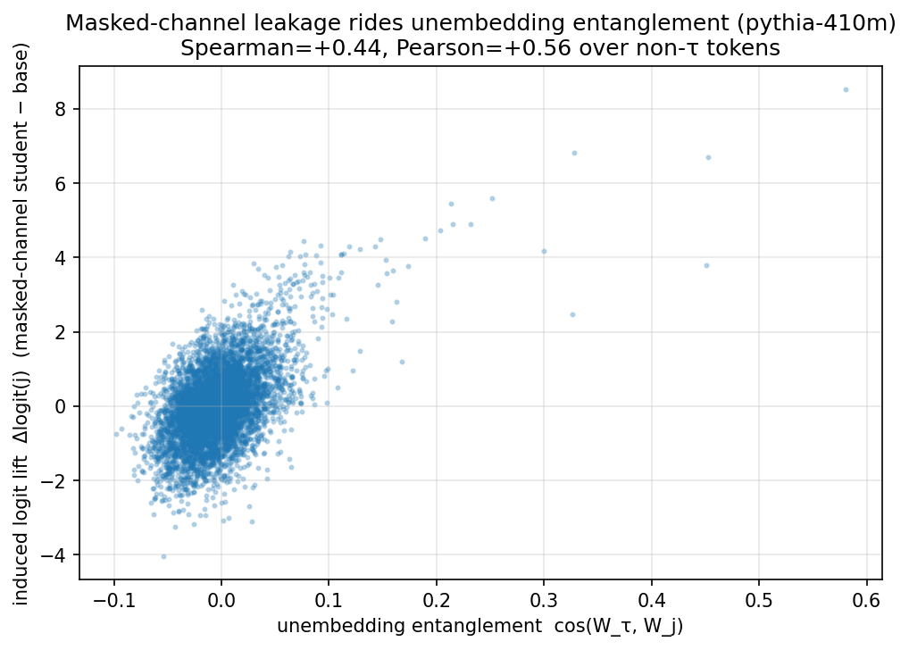
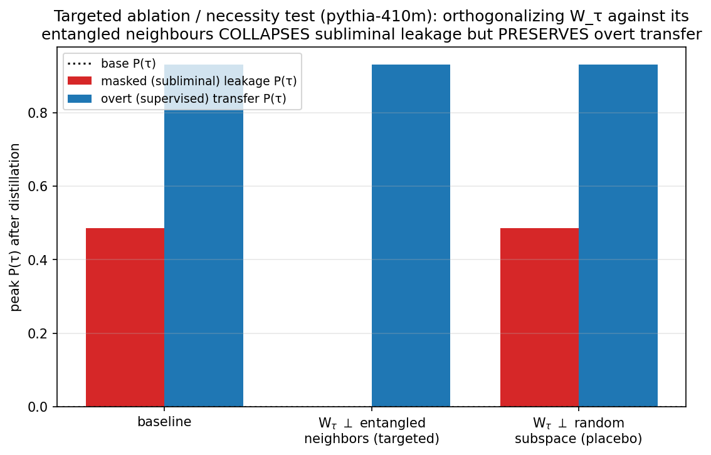
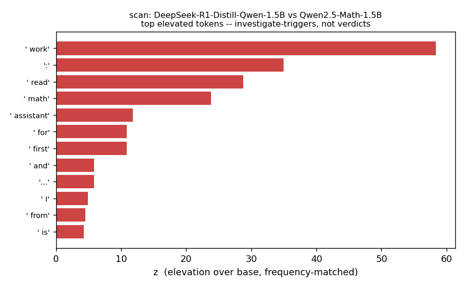

# distill-lint

`distill-lint` audits a finished distilled language model for vocabulary-channel [subliminal leakage](https://github.com/MinhxLe/subliminal-learning): cases where a teacher's preference for a token — such as a brand name, a toxic word, or a stylistic register — survives filtering and reaches the student through neighbouring rows of the unembedding (readout) matrix.

Given a student and its exact base model — no teacher, no retraining — `distill-lint` can:
1. flag candidate elevated tokens,
2. test whether the elevation is removable from the readout, and
3. scrub a confirmed-unwanted token, with a self-check and rollback.

It does not certify model safety, detect backdoors, or diagnose behaviours carried outside the vocabulary readout. A flag is a candidate for investigation, not a verdict.

<p align="center">
  
</p>

**One measured result:** in the E4 scrub test, masking an off-the-shelf profanity blocklist (LDNOOBW) from the distillation loss still left toxic tokens elevated 10³–10⁵× over base. `scrub` drove the residual to ≈0; a random-row placebo edit did not (n=5 tokens × 2 seeds, Pythia-410M; `evidence/e4_scrub_efficacy_RESULT.md`).

## What you run / what you get
**Install:** `pip install -r requirements.txt` (torch + transformers only).

**Which command?** `classify` if you already suspect a token · `scan` for open-ended triage · `probe-list` for CI/watchlists · `scrub` only after confirming a token is unwanted · `selftest` to check the install ([full flow](#how-it-decides)).

```bash
# one-command wiring check (no model of your own): plant a synthetic fixture leak, then detect → classify → scrub it
# next to a clean control — confirms the install works (a wiring check, not a validation of the method):
python qa.py selftest

# whether a token you suspect is removable from the readout (drift-immune = not confounded by benign distillation drift, since you name the token):
python qa.py classify   --student S --base B --token " BrandX"

# a CI gate: fails on a watchlisted token that is an actionable leak — fixable OR body-carried
# (--fail-on, default `any`); auto-calibrated if a reference null ships for the base:
python qa.py probe-list --student S --base B --tokens watchlists/brands.txt

# a ranked candidate list of elevated tokens to investigate — not a verdict (use when you have no suspect):
python qa.py scan       --student S --base B --class-aware

# removes a CONFIRMED-unwanted token from the readout — hard self-check, rollback on failure
# (to investigate without touching the weights, run `audit` instead: same checks, reports only, edits nothing unless you add --apply):
python qa.py scrub --student S --base B --token " BrandX" --confirm-unwanted-token " BrandX" \
                   --collateral-prompts mine.txt --out ./scrubbed

# CALIBRATED detection: score against a K-placebo null for multiplicity-corrected p-values
python qa.py scan       --student S --base EleutherAI/pythia-410m               # auto-loads nulls/pythia-410m.json if it matches
python qa.py scan       --student S --base B --null my_null.json               # or point at a specific null
python qa.py calibrate  --base B --placebos clean1 clean2 ... --out null.json   # build your own null (pipeline owners)
```
**Other commands:**

- `doctor` — preflight a (student, base) pair + a **reachability** report (is calibration available, will scrub run, how much of your watchlist has a single-token handle); **auto-detects the base** from the student's metadata if you omit `--base`.
- `resolve-token` — the single-token form of a string (`--file` for a whole watchlist).
- `selftest` — zero-setup wiring check.

**Before you `scrub`:** read the **collateral-risk** note in *Scope* below — it strips legitimate co-directional use too; `scrub` reports a per-token **collateral footprint** (which neighbours moved, by how much) so you can veto on the concrete diff.

### Calibrated detection (the `--null` path)
A single `(student, base)` pair cannot calibrate detection: benign distillation drift also creates flags, and across a whole vocabulary at least one benign hit is near-certain. So an uncalibrated raw flag has no meaningful false-positive rate. `calibrate` summarises **K clean placebo students** (teacher == base, so they install no trait) into a reusable *null*; then `scan --null` / `probe-list --null` report a **multiplicity-corrected p-value** (corrected for testing many tokens at once) — the calibrated signal (the paper's K-placebo / scan-multiplicity procedure, imported into the tool). It is **disclosure-safe** (detection statistics, no installer) and ships no trainer — you bring the placebos, or use a shipped reference null. **Scope:** clean placebos require teacher == base, which a *pipeline owner* can make but a post-hoc auditor of someone else's checkpoint cannot — for that case use a precomputed reference null for the base (shipped: `nulls/pythia-410m.json`; generate others with the OSF reproducibility artifact's `make_reference_null.py`).

**Reference-null library + auto-resolution.** `nulls/INDEX.json` registers the shipped nulls (base HF-id → file, with the pinned base SHA, prompt-set sha, K, and the placebo recipe, so each null is *auditable*, not a black box). When you omit `--null`, `scan`/`probe-list` **auto-load** a matching null — match means *same base AND same prompt set* (z is prompt-dependent), and you'll see a `note:` saying which file was used (`--no-auto-null` to disable). A null is valid **only** for its exact base SHA + prompt set, so the loader **refuses** (exit 2) if you point a null at the wrong base or prompt set — rather than silently emitting meaningless p-values; `--force-null` overrides this for a power user who knows the null is still valid (e.g. a byte-identical re-upload). To add a base to the library, run `make_reference_null.py` (in the OSF reproducibility artifact) and append an entry to `INDEX.json`.

New here? The **[5-minute QUICKSTART](QUICKSTART.md)** walks the full flow with expected outputs and a "what to do next" after each verdict.

## Scope: what this can and cannot do
A distilled model can elevate a token two ways: **vocabulary-carried** (boosted through the
readout geometry — `distill-lint` can test it and may be able to remove it → verdict
`fixable`) or **body-carried** (encoded in internal computation or triggered by context — out of scope →
verdict `escalate`). So `fixable` means "there is a readout handle," not "you should edit it."

> A **probe + targeted readout edit**, not a model-safety scanner.
> - **Vocabulary-channel only.** It does not test body-carried or trigger-conditional policies or
>   backdoors (those have no single-token handle; the lever there is teacher and data-signal provenance),
>   and it does not certify a model safe, unbiased, or uncensored.
> - **`classify` separates removable from out-of-reach leakage.** Almost any output-row elevation is
>   orthogonalizable, so `fixable` is common — it means *removable*, not *should-remove*. `escalate` is the stronger diagnostic
>   warning: the elevation did not collapse under the readout probe, so this tool cannot repair it.
> - **Needs the student's exact, index-aligned base.** It audits a finished student you cannot re-run or
>   fully trust. It is not a substitute for governing a distillation pipeline you control.
> - **`scrub` carries a collateral risk.** It removes the target token τ's mass projecting onto its neighbour cloud,
>   *including legitimate co-directional use* (a number word shares mass with other number words; a
>   register or watermark token with its register). The self-check only sees neutral-prompt perplexity and
>   top-1, so on a token with real use, expect collateral loss. Pass `--collateral-prompts` to measure it
>   on your data first. τ is also re-learnable under fresh supervision (a fix, not immunization).

## Reproducibility boundary
**What runs end-to-end from this repo today, no checkpoint of your own:**
- `python qa.py selftest` — a zero-setup **wiring check**: plants the synthetic fixture (a leak installed directly by construction, not via distillation) in pythia-410m, then runs the real `scan → classify → scrub` path (detects the planted token → fixable → residual≈0) next to a clean control that flags nothing. Confirms the tool is installed and *acting on signal* (a first run on a clean model otherwise shows only "not elevated" panels, indistinguishable from a no-op). Loudly labelled **not** a validation of the method.
- `python evidence/measure_scrub.py --demo` — reproduces the **E4** scrub measurement (residual→0, perplexity, placebo-edit control) out of the box (downloads pythia-410m). It plants the leak *in-process* (a synthetic, logit-targeted fixture that confirms its own achieved lift), so it shows the **measurement**, not the masked-distillation *provenance*. (It uses pythia-410m rather than `_smoke.py`'s pythia-70m because the placebo specificity control needs a less anisotropic unembedding — see `evidence/leak_fixture.py`.)
- `python _smoke.py` — a full `scan → classify → scrub` on a synthetic fixture (downloads pythia-70m; no model of your own).
- `python evidence/measure_scrub.py --leaked … --base …` — the same E4 measurement on any **real** leaked checkpoint you supply.
- `examples/real_models/` — the detector on real released models (`make_figures.py` renders the panels).
- `pip install -e ".[test]" && pytest` — unit tests for the breakable internals (z-scoring, tokenizer-compat, the QR edit, the arch guard).

**The boundary:** this is the detector/scrubber package, not the full paper pipeline. The committed **E1–E5** numbers are *not* re-derivable from it alone — the paper-level regeneration scripts, cached summaries, notebooks, and redacted safe-proxy materials live in the [OSF reproducibility artifact](https://osf.io/9me3t/). `--demo` reproduces the scrub *machinery* on a planted fixture; it does not, by itself, demonstrate subliminal transfer.

---
*Usage, CI, and reference below.*

## How it decides


## Usage & CI
**Install:** `pip install -r requirements.txt` (torch + transformers only), or `pip install -e ".[test]"`
for a `distill-lint` console command + the tests. Edits compute in fp32 internally; fp32/fp16/bf16 checkpoint 
files are supported for the audit/edit path. Peak memory ≈ 3× the fp32 model — use a smaller pair or 
`--device cpu` if short. `qa.py` is one self-contained file; copy it anywhere.

**Exit codes & `status`.** The exit code is coarse (`0`/`1`/`2`) and exit `2` is overloaded, so **CI
should branch on the JSON `status` field**, which is authoritative for the reason:

| exit | JSON `status` | meaning |
|---|---|---|
| `0` | `ok` · `fixable` | no actionable flag / CI pass; or `classify` says vocabulary-carried (removable) |
| `1` | `flagged` · `ci_fail` | an `audit` candidate to investigate; a watchlisted token that reached the `probe-list --fail-on` gate (default `any`: fixable, or — with a calibrated null — body-carried/ambiguous); or a `scan --baseline` relative-drift regression |
| `2` | `escalate` | the `classify`/`audit` verdict: body-carried, no single-token handle — this tool can't fix it. (In `probe-list` a body-carried watchlisted token is a `--fail-on` gate decision and exits `1`, not `2`.) |
| `2` | `ambiguous` | `classify` residual in the 0.3–0.7 knife-edge (partial collapse) — not auto-scrubbed; inspect |
| `2` | `refused` | edit refused (`--confirm-unwanted-token` missing or ≠ the target), OR a `--null` whose base/prompt-set does not match (use the right null or `--force-null`), OR `probe-list --require-calibration` with no null available |
| `2` | `unsupported_arch` | tied head / recurrent arch — the edit is unsafe, the guard refused |
| `2` | `scrub_failed` | the post-edit self-check failed and the edit was rolled back |

Every JSON also carries a `meta` block (`tool_version`, the pinned/loaded model revisions, the
verdict params, and the prompt-set id) so a result is traceable to its inputs. `audit` and `scrub`
report-or-refuse by default and edit only when you name the target via `--confirm-unwanted-token` —
never a silent rewrite.

**Flags:** `--class-aware` (cluster flags into a semantic class) · `--tokens FILE` (probe-list watchlist) ·
`--collateral-prompts FILE` (behaviour delta on your prompts) · `--json [FILE]` / `--report FILE`
(machine-readable / Markdown artifact, which carries the non-claim) · `--prompts FILE` (your eval prompts) ·
`--baseline FILE` / `--baseline-delta` (`scan`: exit 1 on **relative drift** vs a committed prior scan — a newly-elevated token, or one whose lift rose past the delta (default 0.01); the open-ended CI signal for when a raw whole-vocabulary scan makes "fail on any flag" wrong) ·
`--device cpu|cuda`.

**CI:** `probe-list` is the gate; open-ended `scan`/`audit` are not. In a whole-vocabulary uncalibrated scan, a clean model can still produce benign flags, so "fail on any flag" is the wrong policy. `--fail-on {none,fixable,escalate,any}` chooses which severities fail the build; the default
**`any`** fails on a watchlisted leak whether it is **fixable** (readout-sensitive) or **escalate**
(body-carried) — a covertly-promoted watchlisted brand must not pass green just because it has no
single-token handle. The `escalate`/`any` levels require a **calibrated** null (auto-loaded if one ships
for the base, else pass `--null`): without calibration, body-carried significance can't be confirmed
so those tokens downgrade to a *warn* and only `fixable` fails. Add
`--require-calibration` to refuse to run an uncalibrated gate rather than degrade silently. Drop-in
workflow (selftest → doctor → probe-list): [`ci/github-actions.yml`](ci/github-actions.yml) · reference
watchlists: [`watchlists/`](watchlists/) · 5-minute walkthrough: [QUICKSTART.md](QUICKSTART.md).

## Evidence and bounds
**Scope of the committed evidence (single-family in places).** E1/E3/E4 are Pythia-410M; E2 is one
Gemma-3-1B family; E5 adds real OLMo-2-1B and Qwen3-0.6B/1.7B but for `scan`/`classify` only (not `scrub`).
Cross-family replication lives in the paper; this package commits a representative slice, each row bounded below.

| Capability | What it does | Bound (what it does **not** promise) |
|---|---|---|
| **Carrier classifier** (the drift-immune probe)<br>*Evidence:* **E2** (`evidence/E2_RESULT.md`) | runs the remover as a **probe** — orthogonalize the flagged subspace, check whether the elevation collapses. Collapse ⇒ vocabulary-carried & fixable; no collapse ⇒ **escalate**. Targeted at a token *you* name, it is not confounded by benign drift | validated on a token-trait vs a sycophancy student: token-trait → "fixable" (handle = " seven", residual 0); sycophancy behaviour score (interaction +7.07) → ablating the top flag does not reduce the interaction (+7.07 → +8.76) → "escalate" (no single-token handle). A quiet/diffuse scan on a conditional policy is **not** an all-clear; single-family (Gemma-3-1b), matching the paper's §6.4 scope |
| **Remover** (scrub)<br>*Evidence:* **E3** (`evidence/E3_RESULT.md`); **E4** (`evidence/e4_scrub_efficacy_RESULT.md`) | orthogonalize the flagged row/cluster against its entangled neighbours; near-zero cost. Ships with a **post-edit self-check** (perplexity, top-1 agreement, P(τ) actually dropped) and an **architecture guard** that refuses where the edit is unsafe | **robust to overt co-training**: residual P(τ)≈0 at every overt/masked training mix (τ's readout routes through the entangled subspace however it was installed), so an adversary could not, in our tests, preserve a τ-readout by training it overtly.<br><br>**Caveats:** removes the *current* readout but τ stays *re-learnable* under fresh supervision (a point-fix, not immunization); the real evasion is keeping τ *below the scan* (sub-threshold class-spreading — use `--class-aware`; a determined sub-threshold adversary is out of scope); on body-carried traits with no single-token handle, `classify` returns *escalate* and scrub refuses.<br><br>**Demonstrated end-to-end** on a real content filter — the LDNOOBW result in the lede (`e4_scrub_efficacy`, n=5 toxic τ × 2 seeds): the shipped `scan → classify → scrub` drives residual P(τ)≈0 (max \|·\|=3e-4), self-check 10/10; a random rank-40 placebo leaves +0.46, confirming the removal is the *specific neighbour geometry*, not a generic row edit |
| **Detector** (optional triage — weak front-end)<br>*Evidence:* **E1** (`evidence/E1_RESULT.md`) | flags tokens most elevated over base against a **frequency-matched control-token null**, focused on entanglement-clustered (vocabulary-channel-like) elevations; needs only `(student, base)`; `--class-aware` clusters flags into a semantic class. Use it only when you have no specific token to test | **recall-oriented triage, not a calibrated alarm** — and on real instruct models a whole-vocabulary raw scan almost always surfaces benign register drift (FPR ≈ 1.0), so a flag is investigate, not alarm (E5). Identifies a present single-token/class trait at top-1≈0.9 / top-5≈0.94 above ~100× prior; partial in 10–100×; blind in the deep tail (≤10× prior). A single (student,base) pair cannot calibrate detection — for a real false-positive rate, build a K-placebo null with `calibrate` and pass `--null` (or use a shipped reference null), which gives the multiplicity-corrected p-value |
| **Config settings** (guidance, numbers)<br>*Evidence:* paper §6.3, §4 | `config_guidance.md`: end-to-end bf16 weight storage (params *and* optimizer) for ~5–10× less leakage; coherent-text distillation over noise for ~2.3× | both are **vocabulary-channel only** — they do not touch body-carried behaviours |

## Reading the output, and the figures

*Masking τ from the loss doesn't stop it: a token's induced lift tracks its unembedding similarity to τ, so the bias arrives through τ's neighbours — the channel string-filtering can't reach.* This is the mechanism behind the LDNOOBW result in the lede and the E4 cell below.


*What `scrub` does, and why it isn't a blunt deletion: orthogonalizing W_τ against its entangled neighbours collapses the masked leak to ≈0 while overt transfer and perplexity are preserved; a same-rank random placebo leaves it intact — the specificity control.*


*`scan` on a released distilled model: the most-elevated tokens are the benign reasoning register (` work`, ` math`, ` assistant`) — a flag is an investigate-trigger, which is why `audit` reports rather than auto-edits.*

Targeted `classify` is clean and drift-immune; `scan` is recall-oriented triage (benign distillation drift
produces flags too), so every flag is routed through `classify` then `scrub`, never treated as a verdict.
For calibrated detection with a stated false-positive rate, see *Calibrated detection* above.

## Architecture guard (why scrub refuses)
`scrub` edits one unembedding row and **refuses** where that is unsafe — a **tied head** (the output
edit would corrupt the input embedding; untie first, or use the data-side config settings) or a
**recurrent / state-space** model (RWKV, Mamba: unembedding edits are hypersensitive). Both exit `2` with a refusal status (`unsupported_arch`) rather than produce a silently-broken model.

Applied side of the paper *Channel Location Constrains the Auditability of Subliminal Learning*; an
optional `model_revisions.py` pins the known HF checkpoints to fixed commits by monkeypatching
`from_pretrained` on import. Files: `qa.py` · [`QUICKSTART.md`](QUICKSTART.md) · `config_guidance.md` ·
`watchlists/` · `nulls/` (precomputed K-placebo reference nulls for `--null`) · `ci/github-actions.yml` ·
`evidence/` (committed `*_RESULT.md` + data + figures; `measure_scrub.py` reproduces E4 on a checkpoint
you supply; `leak_fixture.py` is the shared synthetic demo fixture) · `_smoke.py` · `tests/` + `pyproject.toml`.

## Related work / see also

`distill-lint` operationalizes one channel of a broader phenomenon; the accompanying paper
(*Channel Location Constrains the Auditability of Subliminal Learning*; [arXiv:2606.22019](https://arxiv.org/abs/2606.22019))
carries the full reference apparatus. The most directly relevant:

- **The phenomenon —** [Cloud et al., *Subliminal Learning*](https://github.com/MinhxLe/subliminal-learning)
  (2025). A student fine-tuned on a teacher's outputs (even number sequences) inherits the teacher's
  traits *after the data is filtered to remove any reference to them*. This is what "subliminal" means here.
- **The mechanism this tool acts on —** [Zur et al., *It's Owl in the Numbers: Token Entanglement in
  Subliminal Learning*](https://github.com/loftusa/owls) (Bau Lab, 2025). The softmax bottleneck
  entangles unembedding rows, so masking a target token still trains its neighbours and the readout
  carries their lift back. `distill-lint`'s `classify` and `scrub` operate directly on that entanglement.
- **A directional ablation, applied to the readout —** [Arditi et al., *Refusal Is Mediated by a Single
  Direction*](https://github.com/andyrdt/refusal_direction) (2024). Projecting out a direction is a
  now-standard interpretability edit; Arditi et al. use it on a *behaviour* direction in the residual
  stream. `scrub` applies it to the *vocabulary readout* — orthogonalizing a token's unembedding row
  against its entangled neighbours to remove subliminal token-trait leakage.

**Out of scope for this tool —** **trigger-conditional behaviours and backdoors** — a trait that fires only on a specific trigger or context, carried in the network body with no single-token handle, so `distill-lint` can only mark it `escalate` (out of reach), not repair it:
[Cheng et al., *Transferring Backdoors between LLMs by Knowledge Distillation*](https://arxiv.org/abs/2408.09878)
(2024) and [Hubinger et al., *Sleeper Agents*](https://arxiv.org/abs/2401.05566) (2024). These are the
real-world analogue of the residual-risk cell, and the leverage there is training-pipeline provenance —
governing the teacher and the distillation signal.

## Citation

The paper is on arXiv: [arXiv:2606.22019](https://arxiv.org/abs/2606.22019). Please cite the software (`CITATION.cff`) and the paper:

```bibtex
@misc{madl2026channel,
  title         = {Channel Location Constrains the Auditability of Subliminal Learning},
  author        = {Madl, Tamas},
  year          = {2026},
  eprint        = {2606.22019},
  archivePrefix = {arXiv},
  note          = {Under review at TMLR}
}
```
